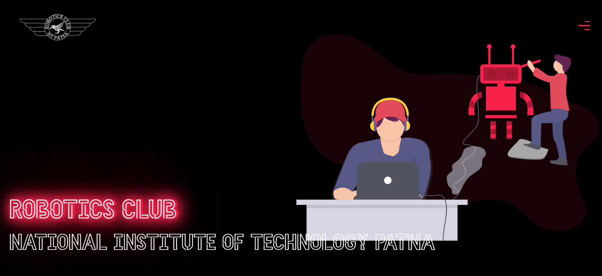

<h1 align='center'> Robotics Club NIT, Patna 🐱‍👤 </h1>
Robotics club has been embodiment of innovation at NIT Patna. Being formed in year 2015-16 by Nripendra Saroj Sir, our club boasts a glorious legacy. With our members ranging from seasoned coders to brilliant designers to hardware scientists, Our members have also represented our college at Smart India hackathon, headed by our current Captain Dheeraj Kumar Sir. We have been constantly working to enhance the students’ technical skills and making them aware of the fascinating world of automation, robotics and electronics which surrounds us. Boasting of a huge roster of exciting and engaging events, This year’s techno-cultural fest was nothing less than a rollercoaster ride for us.


# roboticsclubnitpweb
Official website of robotics club NITP



Project has following functionalities

1. Creating a Component in React
2. Making HTTP calls
3. Communicating between parent and child component
4. Using Basic Routing in React


# Prerequisites 👨‍💻

### Install Node JS
Refer to https://nodejs.org/en/ to install nodejs

### Install create-react-app
Install create-react-app npm package globally. This will help to easily run the project and also build the source files easily. Use the following command to install create-react-app

```bash
npm install -g create-react-app
```
## Live WebSite URL

The WebSite is deployed in https://roboticsnitp.co.in/

Click on the link to see the website.

## Cloning and Running the Application in local

Clone the project into local.

Install all the npm packages. Go into the client folder and type the following command to install all npm packages

```bash
npm install
```

In order to run the application Type the following command

```bash
npm start
```

The Application Runs on [localhost:3000](https://localhost:3000)


`Contributions are welcome 🎉🎉`

# Ways to contribute:
1. Solve the issues which are listed
2. Create your own issue and then send PR.

Please refer to the project's style and contribution guidelines for submitting patches and additions. In general, we follow the "fork-and-pull" Git workflow.

 1. **Fork** the repo on GitHub
 2. **Clone** the project to your own machine
 3. **Commit** changes to your own branch
 4. **Push** your work back up to your fork
 5. Submit a **Pull request** so that we can review your changes


### 🚀 Please abide by  **Contributing Guidelines** and **Code of Conduct**.


## Contributors ✨

Thanks goes to these wonderful people ❤️:

<!-- ALL-CONTRIBUTORS-LIST:START - Do not remove or modify this section -->
<!-- prettier-ignore-start -->
<!-- markdownlint-disable -->
<a href = "https://github.com/Mohdzubair3056/roboticsclubnitpweb/graphs/contributors">
  
</a>

<!-- markdownlint-restore -->
<!-- prettier-ignore-end -->

<!-- ALL-CONTRIBUTORS-LIST:END -->
